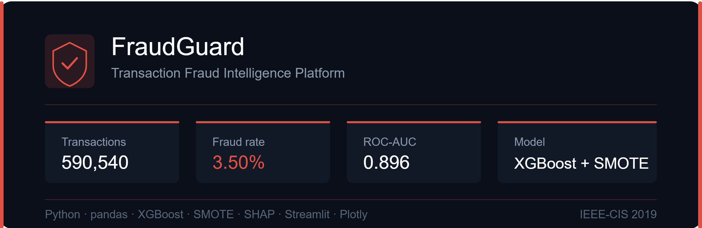

# FraudGuard - Transaction Fraud Intelligence Platform

A real-time transaction fraud detection system built on 590,540 
IEEE-CIS payment records. Designed to address the core challenge 
facing fraud operations teams: balancing fraud loss prevention 
against legitimate customer experience - the Fraud-Friction trade-off.

---

## Business Context

Payment fraud costs the global banking industry billions annually, 
with card-not-present (CNP) fraud growing fastest as digital 
transactions scale. For a retail bank operating at scale, the 
challenge is not simply detecting fraud - it's balancing two 
asymmetric costs: financial loss from undetected fraud, and customer 
relationship damage from incorrectly blocking legitimate transactions.

FraudGuard delivers a machine learning-powered transaction scoring 
tool that minimises both false negatives and false positives 
simultaneously - enabling Fraud Operations teams to prioritise 
investigations and protect both revenue and customer relationships.

---

## What's Built

### 1. Exploratory Data Analysis (Notebook 1: 01_eda)
- Target variable examination - 3.5% fraud rate, 28:1 class imbalance
- Missing data analysis - 205 binary missingness indicators created
- Business-framed EDA: fraud rate by product type, card type, hour
- Key finding: CNP transactions carry 11.7% fraud rate - 3.3× average

### 2. Feature Engineering (Notebook 2: 02_features)
- Three-tier missing data strategy - missingness preserved as signal
- Time features: hour, day, night flag, weekend flag
- Velocity features: card transaction count, mean spend, deviation
- Categorical encoding: label encoding + frequency encoding
- Final feature set: 60 domain-justified features

### 3. Predictive Model (Notebook 3: 03_model)
- XGBoost with SMOTE resampling (3.5% → 9% fraud in training)
- Time-based train/test split - train days 1-141, test days 141-182
- ROC-AUC: 0.896 | Average Precision: 0.497
- Threshold tuning: optimal 0.143 catches 59.6% of fraud
- SHAP explainability - C5, is_weekend, time features dominate

### 4. FraudGuard Dashboard (Streamlit)
- **Transaction Overview** - KPI cards, fraud by product and card type
- **Fraud Pattern Analysis** - hourly patterns, PR curve, model metrics
- **Transaction Scorer** - live fraud probability scoring tool

---

## Key Findings

1. **CNP fraud dominates** - Product C carries 11.7% fraud rate,
   3.3× the portfolio average of 3.5%
2. **Credit cards 2.8× riskier than debit** - 6.7% vs 2.4%
3. **Fraud peaks early morning** - hours 3-9 show above-average rates
4. **Missingness is signal** - 205 binary indicators capture
   fraudster digital footprint gaps
5. **SHAP surprise** - anonymised count features (C5, C14, C1)
   outperform transaction amount and card type

---

## Fraud-Friction Trade-off

| Threshold | Fraud Caught | Legit Blocked | Fraud-Friction |
|---|---|---|---|
| 0.500 (default) | 34.7% | 0.4% | 2.9:1 |
| 0.143 (optimal) | 59.6% | 3.8% | 0.6:1 |

Threshold selection is a business policy decision - higher recall 
costs more false positives. FraudGuard exposes this trade-off 
explicitly rather than hiding it behind a single accuracy metric.

---

## Tech Stack

| Tool | Purpose |
|---|---|
| Python / pandas / numpy | Data wrangling and EDA |
| XGBoost | Fraud detection model |
| imbalanced-learn (SMOTE) | Class imbalance handling |
| SHAP | Model explainability |
| Streamlit + Plotly | Interactive dashboard |
| Jupyter Notebooks | Analysis and documentation |

---

## Project Structure
fraud-detection/
├── data/
│   └── [charts and processed outputs]
├── notebooks/
│   ├── 01_eda.ipynb
│   ├── 02_features.ipynb
│   └── 03_model.ipynb
├── src/
│   ├── app.py
│   └── requirements.txt
└── README.md
---

## PACE Framework

- **Plan** - Business problem, stakeholder map, cost matrix,
  Fraud-Friction Ratio defined
- **Analyse** - EDA, class imbalance, missingness as signal
- **Construct** - Feature engineering, SMOTE, XGBoost, threshold tuning
- **Execute** - Dashboard delivery, model validation, deployment

---

## Running the Dashboard

```bash
cd src
streamlit run app.py
```

Note: Model rebuilds on first load (~3-5 minutes).
Subsequent page navigation is instant via caching.

---

## Live Dashboard

🔗 [FraudGuard - Live App](https://fraudguard-cbsatymzduhsdugbazz54h.streamlit.app/)

---

## Data

IEEE-CIS Fraud Detection dataset (Kaggle, 2019).
Used for educational and portfolio purposes only
per Kaggle competition rules.
Raw data files are not redistributed.

---

*Author: Shubham Yadav | 
[LinkedIn](https://linkedin.com/in/sy1394/) | 
[Portfolio](https://syadav-tech.github.io/syadav-tech/)*
